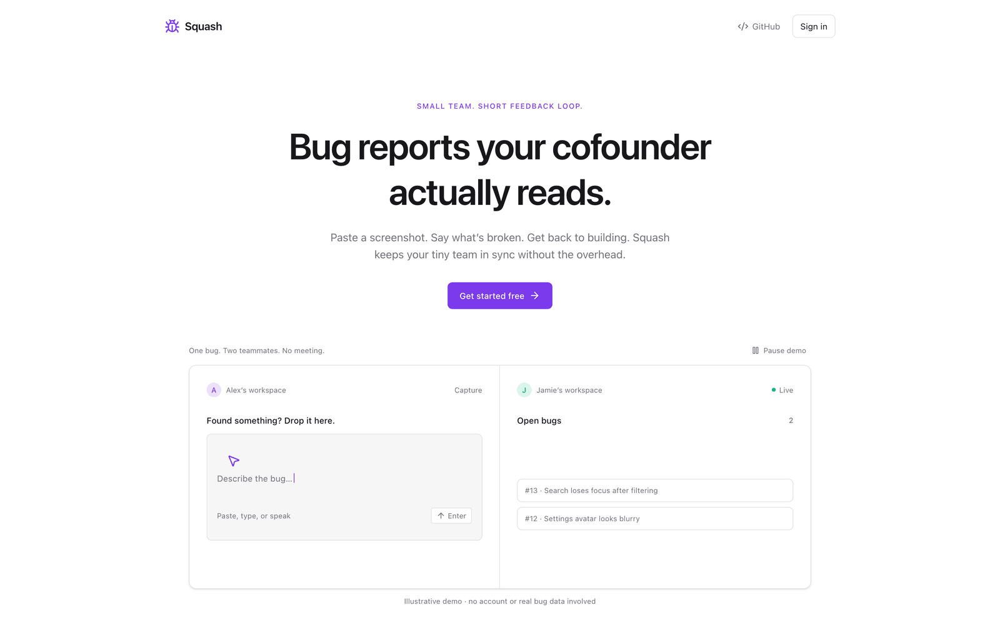

<div align="center">


# Squash

**Bug reports your cofounder actually reads.**

Paste a screenshot, say what's broken, and it shows up on your teammate's screen in about a second.
A real-time bug tracker built for founding teams of 2–10 people.

[**Try it live →**](https://squash-livid.vercel.app) &nbsp;·&nbsp; [Self-host](#self-host) &nbsp;·&nbsp; [Changelog](CHANGELOG.md)

[](https://github.com/ysta32/squash/actions/workflows/ci.yml)
[](https://github.com/ysta32/squash/releases/latest)
[](LICENSE)


<br />

<picture>
  <source media="(prefers-color-scheme: dark)" srcset="docs/screenshots/landing-dark.png" />
  <source media="(prefers-color-scheme: light)" srcset="docs/screenshots/landing-light.png" />
  
</picture>

</div>

## Why Squash

Most bug trackers are built for teams with a project manager. Squash is built for two founders sharing one Slack channel that's full of screenshots nobody can find again.

- **Capture beats triage.** One input, always on screen. Paste an image, type or talk, press Enter. The title writes itself.
- **Live by default.** New bugs, edits, comments and resolutions reach everyone in the workspace in about a second, with no refresh.
- **Accountability built in.** Every filed, edited, resolved, reopened and commented action is written to an append-only log by database triggers, so it can't be skipped.
- **Invite in 30 seconds.** Sign in with Google, name a workspace, send the link.

## Features

**Capture**

- Paste an image anywhere on the page with ⌘V or Ctrl+V, and the cursor jumps to the capture bar so you can type what's wrong straight away. Drag-and-drop and a file picker also work, and the picker opens the camera on mobile.
- Images are compressed in the browser to WebP: at most 1920 px on the long edge, a target of 300 KB, and a 5 MB cap per original.
- Voice dictation uses the Web Speech API, with a live interim transcript. It works in Chrome, Edge and Safari and is hidden where unsupported.
- Bugs appear instantly, and uploads finish in the background with a progress ring.
- On macOS, a global hotkey files a bug from any app. Press <kbd>⌃⌥S</kbd>, drag over what's broken, and Squash comes to the front with the screenshot on your clipboard: press ⌘V, type, and press Enter. It switches to your open Squash tab in Chrome, Arc, Brave, Edge or Safari, or to the installed app, and otherwise opens a new tab. Start it once per session:

  ```sh
  npm run hotkey                                    # or: swift scripts/squash-hotkey.swift
  SQUASH_HOTKEY=cmd+shift+b npm run hotkey          # pick another hotkey
  SQUASH_URL=http://localhost:5173/app npm run hotkey
  ```

  It needs the Xcode command line tools (`xcode-select --install`). macOS asks once to let your terminal record the screen and control your browser.

**Track**

- Bugs and Features live side by side: switch tabs to file and track feature requests apart from bugs, or move an item between them from its detail view.
- Tabs for Open, Resolved and All show live counts.
- Filter by who filed or resolved a bug, or by severity. Full-text search covers titles, descriptions and transcripts.
- See which bug a teammate is viewing, and get a toast when they file one.
- Resolve or reopen with an optional note. Each bug has a full activity timeline and comments.
- A screenshot gallery opens in a lightbox with zoom and arrow-key navigation.

**Team**

- Workspaces with invite links, a workspace switcher, and owner controls: rename, regenerate the invite, remove members, transfer ownership, delete.
- A stats popover shows bugs filed and resolved per person, all-time and for the last 7 days.
- Account deletion cleans up after itself. If you own a shared workspace, you must transfer it first.

**Fix with Claude**

- **Send to Claude** on a bug, or **Send all to Claude** above the list, opens Claude Code in your project with the bugs, their comments and their screenshots. Pick specific bugs with ⌘/Ctrl/Shift-click or <kbd>X</kbd>, then press <kbd>C</kbd>. The copy button next to it copies a ready-to-paste prompt instead; its screenshot links expire after an hour.
- The first press walks you through setup in the app: paste one command into Terminal and the page connects by itself. The command installs a small helper that starts at login on macOS:

  ```sh
  curl -fsSL https://squash-livid.vercel.app/bridge/install.sh | sh -s -- https://squash-livid.vercel.app
  ```

  Self-hosting? Use your own domain in both places. Uninstall with `--uninstall` in place of the trailing address.

- Each workspace opens Claude in its own project folder, in its own Terminal window. You pick the folder the first time you send from a workspace (a native folder picker), and change it with the folder button above the list. Choices are saved in `~/.squash/bridge.json`.
- While Claude works, the bug shows what it is doing: its current step, its plan, its latest message and, when it finishes, its summary. Bugs Claude is on get a pulsing Claude icon in the list, amber when it is waiting for you in Terminal. Progress comes from Claude Code hooks the helper adds to each session, so it is only visible on the computer running the helper. Helpers installed before this need the install command run again.
- The helper listens only on `127.0.0.1:4317`, accepts requests only from Squash, and saves each batch to `.squash/bugs/` in the project (ignored by git). Chrome asks once to let the page reach the local network. To work on the helper itself, run `npm run claude-bridge`; pass extra `claude` flags with `SQUASH_CLAUDE_ARGS`, for example `--permission-mode acceptEdits`. Outside macOS it runs `claude -p` headless and logs to the batch folder.

**Feel**

- A Linear-inspired interface with light and dark themes. It follows your system by default and can be toggled.
- Responsive two-pane layout on desktop and a list-to-detail stack on mobile.
- Installable as a PWA.
- Loading skeletons instead of spinners, and a subtle "Reconnecting…" pill if the live connection drops.

### Keyboard shortcuts

| Key                                                  | Action                                   |
| ---------------------------------------------------- | ---------------------------------------- |
| <kbd>N</kbd>                                         | New bug (focus the capture bar)          |
| <kbd>Enter</kbd> / <kbd>Shift</kbd>+<kbd>Enter</kbd> | File bug / new line                      |
| <kbd>Alt</kbd>+<kbd>1</kbd>–<kbd>4</kbd>             | Set severity while capturing             |
| <kbd>/</kbd>                                         | Search                                   |
| <kbd>J</kbd> / <kbd>K</kbd>                          | Next / previous bug                      |
| <kbd>R</kbd> / <kbd>O</kbd>                          | Resolve / reopen the selected bug        |
| <kbd>X</kbd>                                         | Pick the selected bug for Claude         |
| <kbd>C</kbd>                                         | Send picked (or selected) bugs to Claude |
| <kbd>Esc</kbd>                                       | Close / back to list                     |
| <kbd>?</kbd>                                         | Show all shortcuts                       |

## Security model

Squash is a single public instance where strangers share infrastructure, so every rule is enforced in Postgres, not in the browser.

- **Row Level Security on every table**, plus the storage bucket. Users can only see rows from workspaces they belong to.
- **Joining happens only through an RPC** that validates the invite code. Members can't be added any other way.
- **Screenshots live in a private bucket** under `{workspace_id}/{bug_id}/…` and are served through signed URLs that expire after an hour.
- **Abuse limits are enforced by triggers and RPCs**, with row and advisory locks so they hold under concurrency:

  | Limit                     | Value         |
  | ------------------------- | ------------- |
  | Members per workspace     | 10            |
  | Workspaces owned per user | 5             |
  | Images per bug            | 10            |
  | Bugs filed per user       | 30 per minute |

- **Hardened defaults:** PKCE auth, redirect validation, framing blocked with `frame-ancestors 'none'`, and column-level update grants on profiles.

The policy test suite is in [`supabase/tests/rls.sql`](supabase/tests/rls.sql). See [SECURITY.md](SECURITY.md) to report a vulnerability.

## Tech stack

| Layer   | Choice                                                                                          |
| ------- | ----------------------------------------------------------------------------------------------- |
| App     | React 19, TypeScript 6 (strict), Vite 8, Tailwind CSS 4, React Router 7, Lucide                 |
| Backend | Supabase: Postgres, Auth (Google + magic link), Realtime (Postgres changes + Presence), Storage |
| Quality | Vitest, Testing Library, ESLint, Prettier, GitHub Actions                                       |
| Hosting | Vercel (static SPA)                                                                             |

## Self-host

You need Node.js 24 or newer, a free [Supabase](https://supabase.com) project, and optionally a [Vercel](https://vercel.com) account.

1. **Database.** Run the files in [`supabase/migrations/`](supabase/migrations) in order in the Supabase SQL editor, or use `npx supabase link && npx supabase db push`. It creates the schema, policies, storage bucket and Realtime publication.
2. **Auth.** Enable the Google provider and set your Site URL and redirect URLs. [MAINTAINER.md](MAINTAINER.md) has the exact Google Cloud and Supabase steps.
3. **Configure.** Copy `.env.example` to `.env` and fill in the following. Use the anon or publishable key only, never a service-role key, because every `VITE_` value ships to the browser.

   ```sh
   VITE_SUPABASE_URL=https://<project-ref>.supabase.co
   VITE_SUPABASE_ANON_KEY=<anon or publishable key>
   VITE_GITHUB_URL=https://github.com/<you>/squash
   VITE_SITE_URL=http://localhost:5173
   ```

4. **Run.**

   ```sh
   npm ci
   npm run dev   # http://localhost:5173
   ```

5. **Deploy.** Import the repo into Vercel with the Vite preset, add the same variables using your production URL for `VITE_SITE_URL`, and deploy. `vercel.json` already handles SPA routing and security headers. If a build is missing its Supabase settings, the app shows a setup screen naming the missing variables.
6. **Verify (optional).** Run [`supabase/tests/rls.sql`](supabase/tests/rls.sql) in the SQL editor. It runs inside a transaction and rolls back.

## Development

```sh
npm run dev           # start Vite
npm run typecheck     # tsc, strict
npm run lint          # ESLint
npm run format:check  # Prettier
npm run test          # Vitest
npm run build         # production build
```

```
src/
  components/   UI: capture bar, bug list and detail, header, dialogs, settings
  hooks/        useBugs, useBug, usePresence, useSpeech, usePasteImage, useImageCompression, …
  lib/          Supabase client, typed schema, auth, uploads, theme, utilities
  pages/        Landing, sign-in, onboarding, join, workspace, settings, legal
supabase/
  migrations/   schema, RLS, triggers, RPCs, storage, realtime
  tests/        RLS and abuse-limit assertions
```

## Contributing

Issues and pull requests are welcome. Read [CONTRIBUTING.md](CONTRIBUTING.md) first; it covers the checks CI runs and the conventions the codebase follows.

## License

[MIT](LICENSE) © Squash contributors
