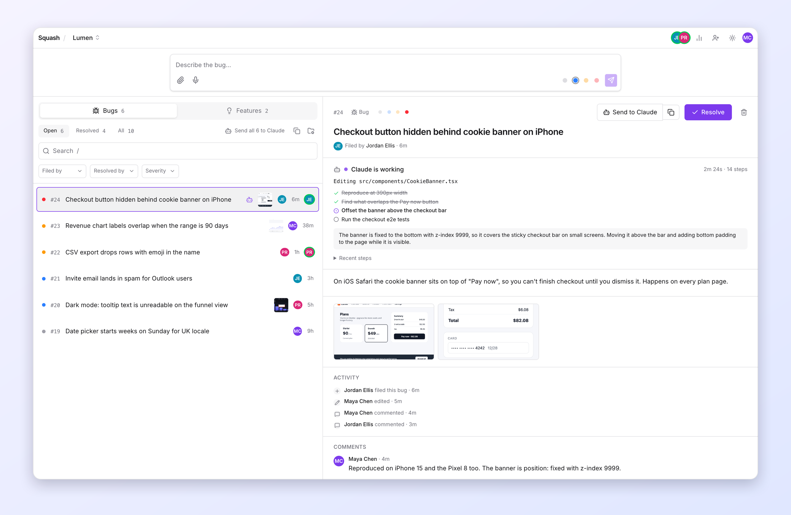
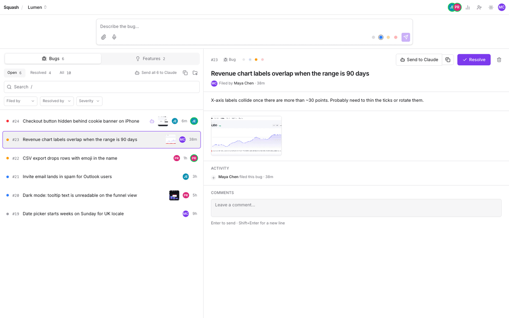
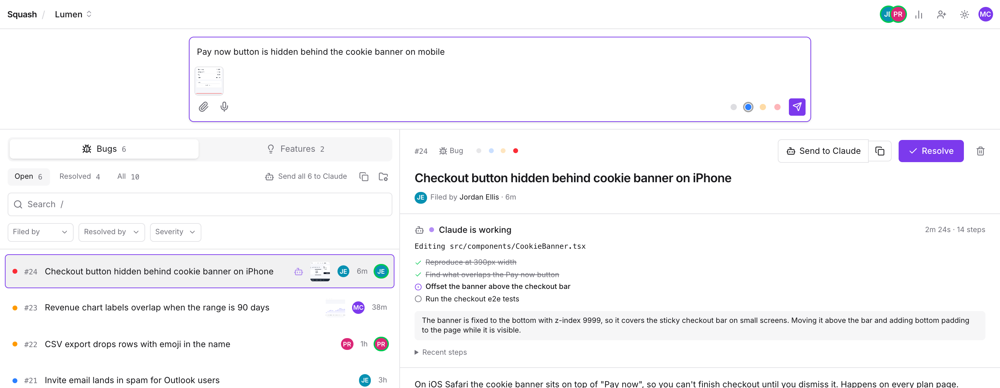
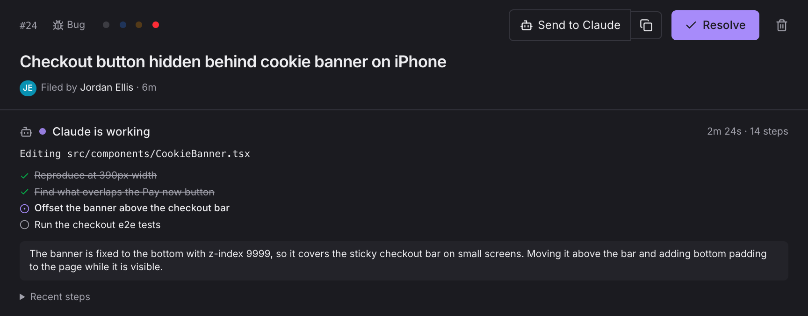
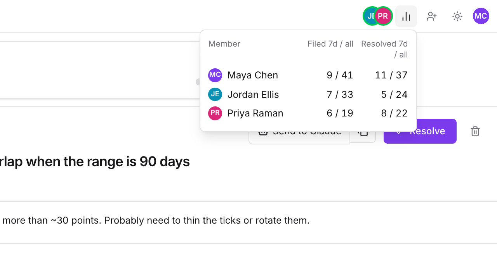
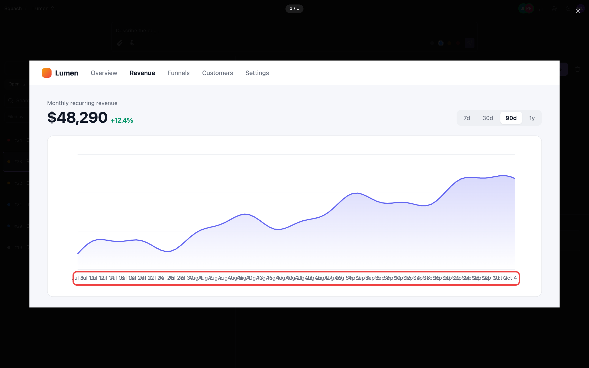
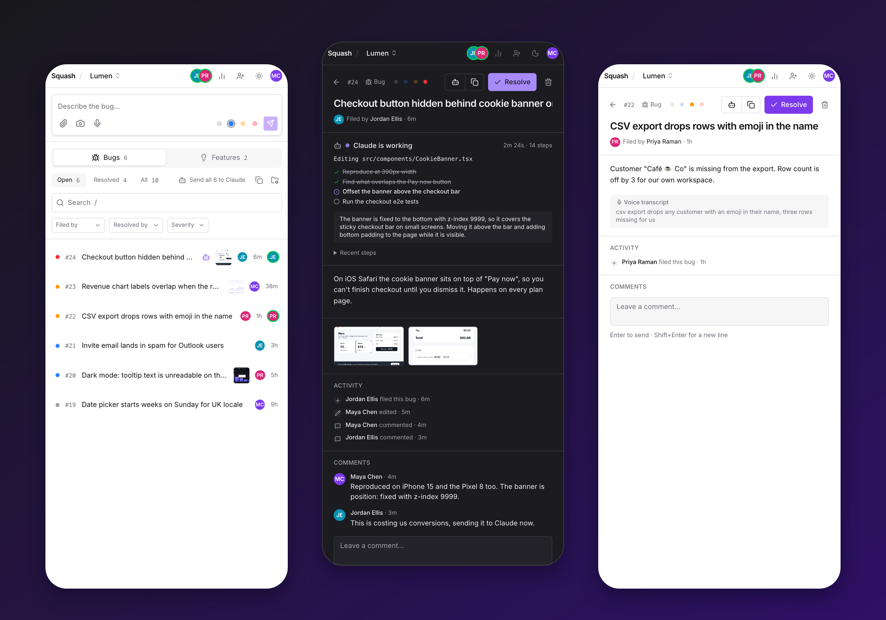
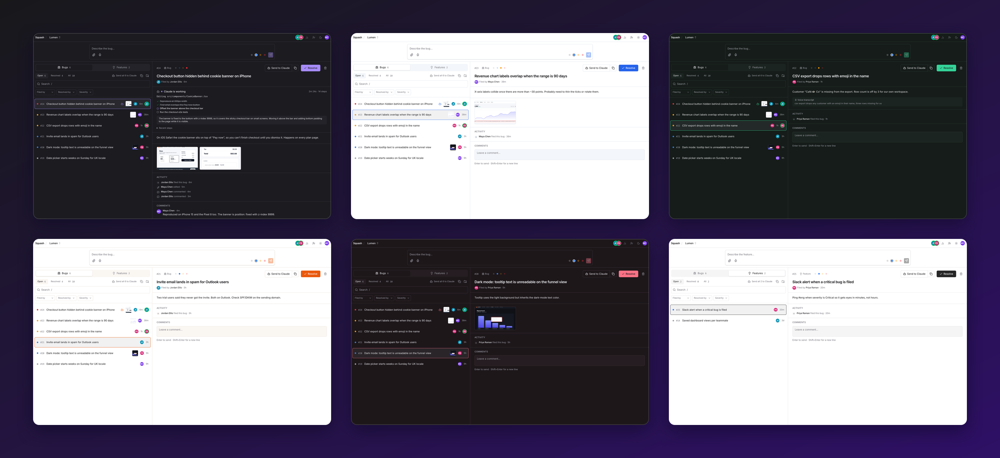

<div align="center">


# Squash

### Bug reports your cofounder actually reads.

Paste a screenshot, say what's broken, press Enter, and it's on your teammate's screen about a second later.<br />
Then send it to Claude Code and watch it get fixed.

**A real-time bug tracker for founding teams of 2–10 people.**

<br />

[**Try it free →**](https://squash-livid.vercel.app) &nbsp;&nbsp;·&nbsp;&nbsp; [Self-host in 5 minutes](#self-host) &nbsp;&nbsp;·&nbsp;&nbsp; [Fix bugs with Claude Code](#fix-bugs-with-claude-code) &nbsp;&nbsp;·&nbsp;&nbsp; [Changelog](CHANGELOG.md)

<br />

[](https://github.com/ysta32/squash/actions/workflows/ci.yml)
[](https://github.com/ysta32/squash/releases/latest)
[](LICENSE)


<br />

<picture>
  <source media="(prefers-color-scheme: dark)" srcset="docs/screenshots/hero-dark.png" />
  <source media="(prefers-color-scheme: light)" srcset="docs/screenshots/hero-light.png" />
  
</picture>

</div>

<br />

## Why Squash

Most bug trackers are built for teams with a project manager. Squash is built for two founders sharing one Slack channel that's full of screenshots nobody can find again.

<table>
  <tr>
    <td width="50%" valign="top">
      <h4>📸&nbsp; Capture beats triage</h4>
      One input, always on screen. Paste an image, type or talk, press Enter. No forms, no required fields, no ticket templates.
    </td>
    <td width="50%" valign="top">
      <h4>⚡&nbsp; Live by default</h4>
      New bugs, edits, comments and resolutions reach everyone in about a second. You can see which bug a teammate has open.
    </td>
  </tr>
  <tr>
    <td width="50%" valign="top">
      <h4>🤖&nbsp; Claude Code fixes them</h4>
      Send one bug or the whole list to Claude Code with screenshots and comments attached. Follow along live; fixed bugs resolve themselves.
    </td>
    <td width="50%" valign="top">
      <h4>🔒&nbsp; Accountable and secure</h4>
      Every action is written to an append-only log by database triggers. Row Level Security on every table and private screenshot storage.
    </td>
  </tr>
</table>

<br />

## From "huh, that's broken" to filed in five seconds

<div align="center">
  
</div>

<br />

Paste a screenshot anywhere on the page with <kbd>⌘V</kbd> / <kbd>Ctrl+V</kbd> and the cursor jumps to the capture bar. Type what's wrong (or dictate it), pick a severity with <kbd>Alt</kbd>+<kbd>1</kbd>–<kbd>4</kbd>, and press <kbd>Enter</kbd>. The bug shows up instantly while its screenshots upload in the background.

<picture>
  <source media="(prefers-color-scheme: dark)" srcset="docs/screenshots/capture-dark.png" />
  <source media="(prefers-color-scheme: light)" srcset="docs/screenshots/capture-light.png" />
  
</picture>

- **Paste, drop, pick or shoot.** Drag-and-drop and a file picker work too, and the picker opens the camera on mobile.
- **Small uploads, automatically.** Images are compressed in the browser to WebP: at most 1920 px on the long edge, a target of 300 KB, and a 5 MB cap per original.
- **Talk instead of typing.** Voice dictation uses the Web Speech API with a live transcript, in Chrome, Edge and Safari.
- **File from any app on macOS.** Press <kbd>⌃⌥S</kbd>, drag over what's broken, and Squash comes to the front with the screenshot ready to paste. [Set up the hotkey ↓](#global-capture-hotkey-macos)

<br />

## Fix bugs with Claude Code

Press **Send to Claude** on a bug, or **Send all to Claude** above the list. Squash opens Claude Code in your project with the bugs, their comments and their screenshots, and shows you what it's doing while it works: its current step, its plan, its latest message, and its summary when it's done.

<picture>
  <source media="(prefers-color-scheme: dark)" srcset="docs/screenshots/claude-dark.png" />
  <source media="(prefers-color-scheme: light)" srcset="docs/screenshots/claude-light.png" />
  
</picture>

- **Unattended.** When Claude finishes, its Terminal window closes and Squash marks each bug it fixed as **resolved**, with Claude's summary as the resolution note. Bugs it couldn't finish stay open with the summary as a comment.
- **One project folder per workspace.** Pick the folder once with a native folder picker; change it anytime from the folder button above the list.
- **Batch it.** Pick specific bugs with <kbd>⌘</kbd>/<kbd>Ctrl</kbd>/<kbd>Shift</kbd>-click or <kbd>X</kbd>, then press <kbd>C</kbd>.
- **Or just copy.** The copy button next to Send produces a ready-to-paste prompt instead (screenshot links expire after an hour).

The first press walks you through setup in the app: paste one command into Terminal and the page connects by itself. The [`/claude`](https://squash-livid.vercel.app/claude) guide has step-by-step instructions and a live check of your helper.

```sh
curl -fsSL https://squash-livid.vercel.app/bridge/install.sh | sh -s -- https://squash-livid.vercel.app
```

<details>
<summary><b>How the helper works</b></summary>
<br />

- The command installs a small helper that starts at login on macOS. Self-hosting? Use your own domain in both places. Uninstall with `--uninstall` in place of the trailing address.
- The helper listens only on `127.0.0.1:4317`, accepts requests only from Squash, and saves each batch to `.squash/bugs/` in the project (ignored by git). Chrome asks once to let the page reach the local network.
- Each workspace opens Claude in its own project folder, in its own Terminal window. Folder choices are saved in `~/.squash/bridge.json`.
- Progress comes from Claude Code hooks the helper adds to each session, so it is only visible on the computer running the helper. Bugs Claude is on get a pulsing Claude icon in the list, amber when it is waiting for you in Terminal. Helpers installed before progress tracking need the install command run again.
- Claude runs as `claude -p --permission-mode auto`; pass other `claude` flags with `SQUASH_CLAUDE_ARGS`, for example `--permission-mode acceptEdits`. Each run logs to `claude.log` in the batch folder, and Claude reports back through `result.json` there. Keep a Squash tab open (or open one later) to apply the results.
- To work on the helper itself, run `npm run claude-bridge`. Outside macOS it runs without a Terminal window.

</details>

<br />

## Built for a team that sits next to each other (or doesn't)

<table>
  <tr>
    <td width="50%" valign="top">
      
      <p><b>Who's carrying the load.</b> Bugs filed and resolved per person, all-time and for the last 7 days.</p>
    </td>
    <td width="50%" valign="top">
      
      <p><b>Screenshots front and center.</b> A gallery with zoom and arrow-key navigation.</p>
    </td>
  </tr>
</table>

- **Presence.** See who's online and which bug each teammate is looking at, and get a toast when someone files one.
- **Bugs and Features side by side.** File and track feature requests in their own tab, and move items between the two.
- **Find anything.** Open, Resolved and All tabs with live counts; filter by who filed or resolved, or by severity; full-text search across titles, descriptions and voice transcripts.
- **A full history.** Resolve or reopen with an optional note, or delete outright. Each bug has an activity timeline and comments.
- **Workspaces.** Invite links, a workspace switcher, and owner controls to rename, regenerate the invite, remove members, transfer ownership or delete. Sign in with Google or a magic link.

<br />

## Everywhere you are

A responsive two-pane layout on desktop and a list-to-detail stack on phones. Install it to your home screen as a PWA.



<br />

## Make it yours

Light and dark themes that follow your system, and six color schemes: Violet, Ocean, Forest, Sunset, Rose and Graphite.



<br />

## Keyboard first

| Key                                                  | Action                                   |
| ---------------------------------------------------- | ---------------------------------------- |
| <kbd>N</kbd>                                         | New bug (focus the capture bar)          |
| <kbd>Enter</kbd> / <kbd>Shift</kbd>+<kbd>Enter</kbd> | File bug / new line                      |
| <kbd>Alt</kbd>+<kbd>1</kbd>–<kbd>4</kbd>             | Set severity while capturing             |
| <kbd>/</kbd>                                         | Search                                   |
| <kbd>J</kbd> / <kbd>K</kbd>                          | Next / previous bug                      |
| <kbd>R</kbd> / <kbd>O</kbd>                          | Resolve / reopen the selected bug        |
| <kbd>X</kbd>                                         | Pick the selected bug for Claude         |
| <kbd>C</kbd>                                         | Send picked (or selected) bugs to Claude |
| <kbd>Esc</kbd>                                       | Close / back to list                     |
| <kbd>?</kbd>                                         | Show all shortcuts                       |

### Global capture hotkey (macOS)

File a bug from any app. Press <kbd>⌃⌥S</kbd>, drag over what's broken, and Squash comes to the front with the screenshot on your clipboard: press <kbd>⌘V</kbd>, type, and press <kbd>Enter</kbd>. It switches to your open Squash tab in Chrome, Arc, Brave, Edge or Safari, or to the installed app, and otherwise opens a new tab. Start it once per session:

```sh
npm run hotkey                                    # or: swift scripts/squash-hotkey.swift
SQUASH_HOTKEY=cmd+shift+b npm run hotkey          # pick another hotkey
SQUASH_URL=http://localhost:5173/app npm run hotkey
```

It needs the Xcode command line tools (`xcode-select --install`). macOS asks once to let your terminal record the screen and control your browser.

<br />

## Security model

Squash is a single public instance where strangers share infrastructure, so every rule is enforced in Postgres, not in the browser.

- **Row Level Security on every table**, plus the storage bucket. Users can only see rows from workspaces they belong to.
- **Joining happens only through an RPC** that validates the invite code. Members can't be added any other way.
- **Screenshots live in a private bucket** under `{workspace_id}/{bug_id}/…` and are served through signed URLs that expire after an hour.
- **An append-only activity log.** Every filed, edited, resolved, reopened and commented action is written by database triggers, so it can't be skipped.
- **Abuse limits are enforced by triggers and RPCs**, with row and advisory locks so they hold under concurrency:

  | Limit                     | Value         |
  | ------------------------- | ------------- |
  | Members per workspace     | 10            |
  | Workspaces owned per user | 5             |
  | Images per bug            | 10            |
  | Bugs filed per user       | 30 per minute |

- **Hardened defaults:** PKCE auth, redirect validation, framing blocked with `frame-ancestors 'none'`, and column-level update grants on profiles.
- **Account deletion cleans up after itself.** If you own a shared workspace, you must transfer it first.

The policy test suite is in [`supabase/tests/rls.sql`](supabase/tests/rls.sql). See [SECURITY.md](SECURITY.md) to report a vulnerability.

<br />

## Self-host

Use the hosted version at [squash-livid.vercel.app](https://squash-livid.vercel.app) for free, or run your own. You need Node.js 24 or newer, a free [Supabase](https://supabase.com) project, and optionally a [Vercel](https://vercel.com) account.

1. **Database.** Run the files in [`supabase/migrations/`](supabase/migrations) in order in the Supabase SQL editor, or use `npx supabase link && npx supabase db push`. It creates the schema, policies, storage bucket and Realtime publication.
2. **Auth.** Enable the Google provider and set your Site URL and redirect URLs. [MAINTAINER.md](MAINTAINER.md) has the exact Google Cloud and Supabase steps.
3. **Configure.** Copy `.env.example` to `.env` and fill in the following. Use the anon or publishable key only, never a service-role key, because every `VITE_` value ships to the browser.

   ```sh
   VITE_SUPABASE_URL=https://<project-ref>.supabase.co
   VITE_SUPABASE_ANON_KEY=<anon or publishable key>
   VITE_GITHUB_URL=https://github.com/<you>/squash
   VITE_SITE_URL=http://localhost:5173
   ```

4. **Run.**

   ```sh
   npm ci
   npm run dev   # http://localhost:5173
   ```

5. **Deploy.** Import the repo into Vercel with the Vite preset, add the same variables using your production URL for `VITE_SITE_URL`, and deploy. `vercel.json` already handles SPA routing and security headers. If a build is missing its Supabase settings, the app shows a setup screen naming the missing variables.
6. **Verify (optional).** Run [`supabase/tests/rls.sql`](supabase/tests/rls.sql) in the SQL editor. It runs inside a transaction and rolls back.

<br />

## Tech stack

| Layer   | Choice                                                                                          |
| ------- | ----------------------------------------------------------------------------------------------- |
| App     | React 19, TypeScript 6 (strict), Vite 8, Tailwind CSS 4, React Router 7, Lucide                 |
| Backend | Supabase: Postgres, Auth (Google + magic link), Realtime (Postgres changes + Presence), Storage |
| Quality | Vitest, Testing Library, ESLint, Prettier, GitHub Actions                                       |
| Hosting | Vercel (static SPA)                                                                             |

## Development

```sh
npm run dev           # start Vite
npm run typecheck     # tsc, strict
npm run lint          # ESLint
npm run format:check  # Prettier
npm run test          # Vitest
npm run build         # production build
npm run screenshots   # regenerate the README images (needs Google Chrome and ffmpeg)
```

`npm run screenshots` runs the real app against an in-memory demo workspace (no Supabase needed) and captures every image in [`docs/screenshots/`](docs/screenshots). Pass a name to reshoot only matching images, for example `npm run screenshots -- claude`. The demo data lives in [`scripts/screenshots/seed.ts`](scripts/screenshots/seed.ts).

```
src/
  components/   UI: capture bar, bug list and detail, header, dialogs, settings
  hooks/        useBugs, useBug, usePresence, useSpeech, usePasteImage, useImageCompression, …
  lib/          Supabase client, typed schema, auth, uploads, theme, utilities
  pages/        Landing, sign-in, onboarding, join, workspace, settings, legal
supabase/
  migrations/   schema, RLS, triggers, RPCs, storage, realtime
  tests/        RLS and abuse-limit assertions
scripts/
  screenshots/  README image harness: mock backend, demo data, capture and compose
```

## Contributing

Issues and pull requests are welcome. Read [CONTRIBUTING.md](CONTRIBUTING.md) first; it covers the checks CI runs and the conventions the codebase follows.

## License

[MIT](LICENSE) © Squash contributors

<br />

<div align="center">
  <sub>Built for small teams who'd rather ship than triage.</sub>
  <br /><br />
  <a href="https://squash-livid.vercel.app"><b>Try Squash free →</b></a>
</div>
